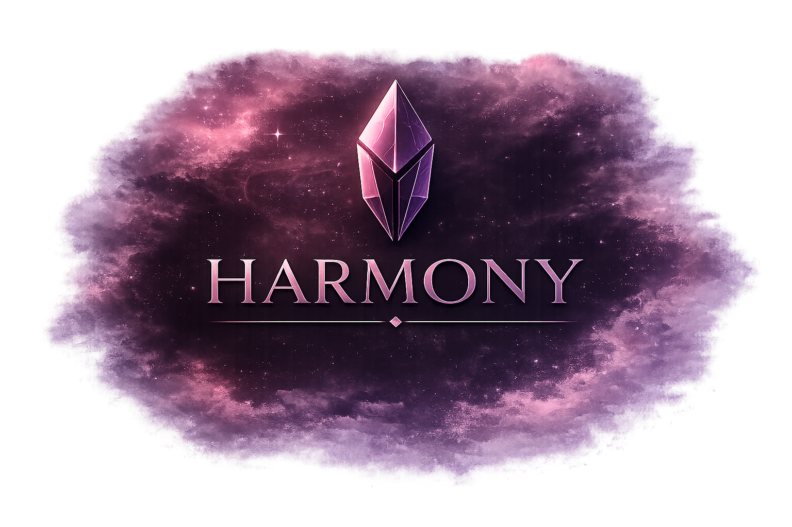
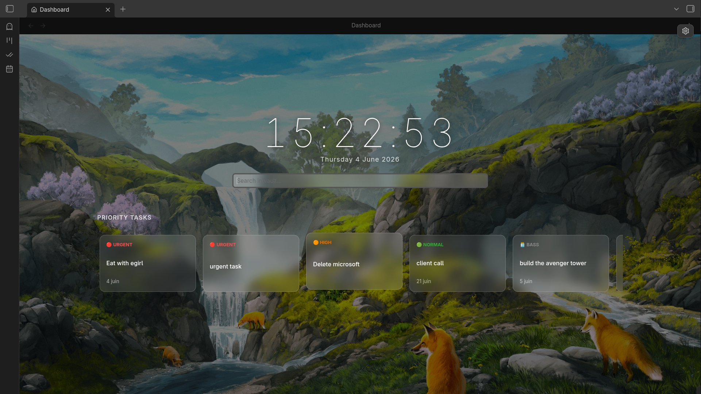
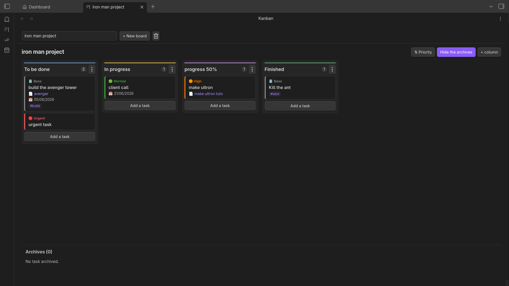
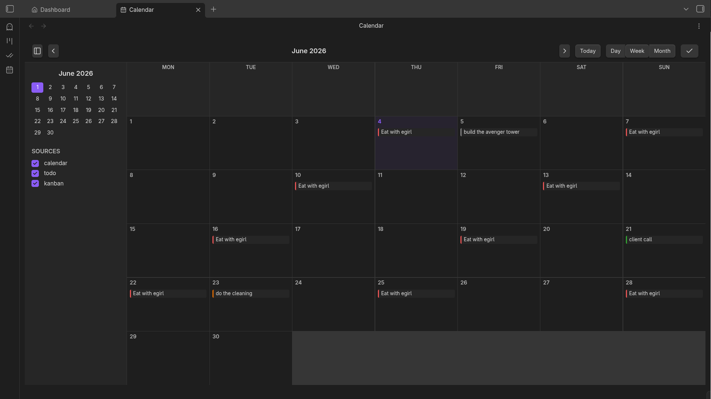
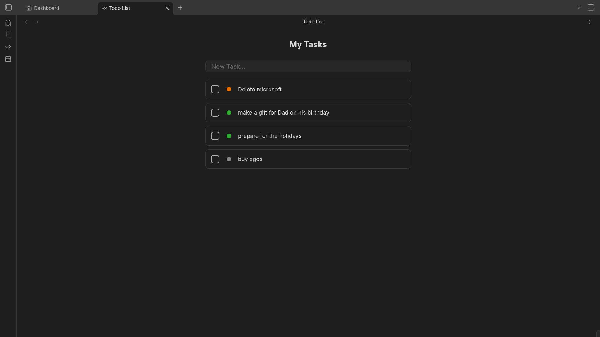

<br>

[](https://community.obsidian.md/plugins/harmony)
[](https://github.com/Yodavatar/Harmony)
[](https://github.com/Yodavatar/Harmony/blob/main/LICENSE)
[](https://github.com/Yodavatar/Harmony)
[](https://harmony.yodavatar.me)
[](https://wakatime.com/badge/user/17a8cdf0-54fb-45e9-92bc-ada49bd926d7/project/2ec1945d-e96e-4557-b324-f72582394db7)

## Table of Contents

- [Introduction](#introduction)
- [Features](#features)
- [Installation](#installation)
- [Usage](#usage)
- [Contribution](#contribution)
- [License](#license)
- [Contact](#contact)

## Introduction

The goal of Harmony is to make Obsidian.
as powerful as a professional tool (like Notion),
but 100% local and open source.

Be as productive as possible by staying in control of your data.
There are many ways to be more productive;
the methods we are trying to implement are [here](https://www.todoist.com/en/productivity-methods).

Harmony is open to contribution.
Look at the [Roadmap](ROADMAP.md) to see what happens next.


## Features

__**1 - Dashboard module**__

Dashboard in a new window.<br>


<br>

- Urgent tasks<br>
- Next tasks<br>
- +More customization options<br>

__**2 - Better Kanban module**__

Kanban is a methode of organisation for a to do list.<br>

 <br>

- Support for multiple boards
- Multiple columns (move left/right, change color, delete)
- Create tasks (multiple priorities, due dates, links, tags, delete)
- Archiving features for notes
- Sort tasks

__**3 - Better Calendar module**__




- Multiple view (daily, weekly, monthly)
- Create tasks (multiple priorities, due dates, delete )
- Support for recurring tasks

__**4 - Minimalist Todo List**__

A simple to-do list organized by priority.<br>



- create a quick task
- Change priority / delete

__**5 - Activated/Desactivated module**__

Enable or disable the module you need, in the Harmony settings.<br>


## Installation

To install Harmony, you can:

1. **Directly from the Obsidian store**:
   Download [here](https://community.obsidian.md/plugins/harmony).<br>

2. **Clone the repository**:

   ```bash
   git clone git@github.com:Yodavatar/Harmony.git
   ```
   
3. **Get to zip**:
   You can get the link to the zip [here](https://github.com/Yodavatar/harmony/archive/refs/heads/main.zip).<br>

## Usage

To use Harmony you need to have last obsidian's version.<br>
You can install Obsidian on [here](https://obsidian.md/download).<br><br>

<br>

Go to settings, on the Community plugins<br>
Then you need to activate community plugins.<br>

Place the project in the "plugins" folder<br>
of the Obsidian Vault you want to test.<br> 


Install dependencies<br>
   ```bash
    npm install
    npm run build //run in the good folder
   ```
Now you return in the Community plugins.<br>
You should see that the pluggin.<br>
The final step is to activate the plugin. <br>


## Contribution

__**Want to contribute to Harmony.**__

We love community contributions! You can find all the guidelines, code standards, and workflow steps in our [Contribution Guide](CONTRIBUTING.md).

## License


This project is licensed under the agpl-3.0.<br>
See the [GNU AFFERO GENERAL PUBLIC LICENSE](LICENSE) file for details.<br>

## Discussions

The Discussions are open [here](https://github.com/Yodavatar/Harmony/discussions).

## Contact

If you have any questions or suggestions, <br>
feel free to contact me at contact@yodavatar.me <br>
